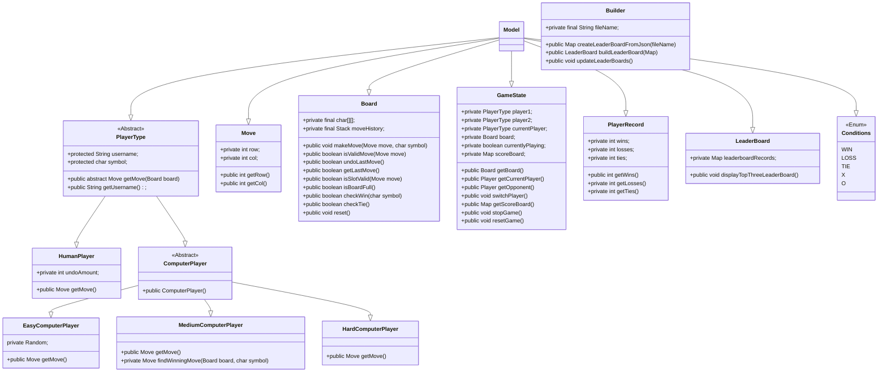
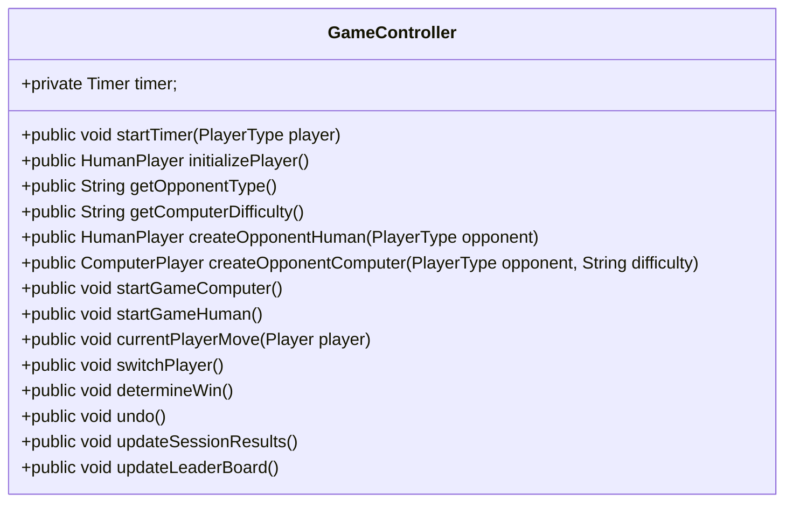
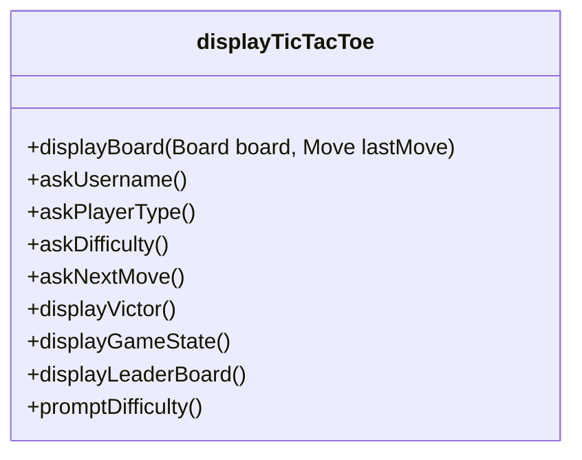

# Final Project Design

## Diagram

My model consists of the board, gameState, playerRecord, leaderboard, move, conditions, and PlayerType  
1) The board will check the conditions of the board itself and make operations on it such as making a move, checking if it is full, checking the conditions of the board (win/loss/tie) along with resetting the board after a game  
2) The gameState will focus on the players of the game, so it makes sure the players are in the game and the player's "turns" are swapped after each round.  
3) The player record will be created when gamestate is implemented to keep tract of each player's current win/loss/tie status during each gamestate. 
4) The player type will demonstrate inheritance in which they can be split into human players and computer players. The computer players are further split into at least 2 difficulties as of yet which are easy/medium (Maybe hard later)
5) The leaderboard will deal with the json file and update the json file according to the stats of each game session.

Controller

My controller will only have one class, but it makes sure the game flows correctly when implemented by working with the view and the model.  
1) It will get the player's username and their chosen opponent type
2) Ensure the player's move gets placed on the board and is updated 
3) Ensure the player's turn gets swapped after each move 
4) Allows for the undo option (for computers, they will delay their choice by 10 seconds, so users will have a brief window to undo their move)
5) Checks for win/loss/tie conditions after each move and will display the board accordingly 
6) Updates game session win/loss/tie records for each player and asks to redo the game 
7) If not, results from game session will be stored into the leaderboard.

View

The view will simply display the contents of the board after each round while also display the print prompt of certain events. Currently set as terminal